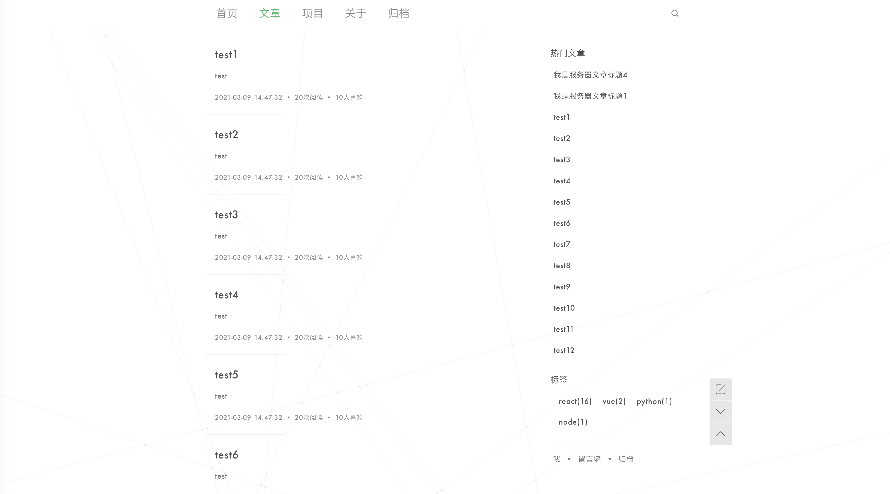
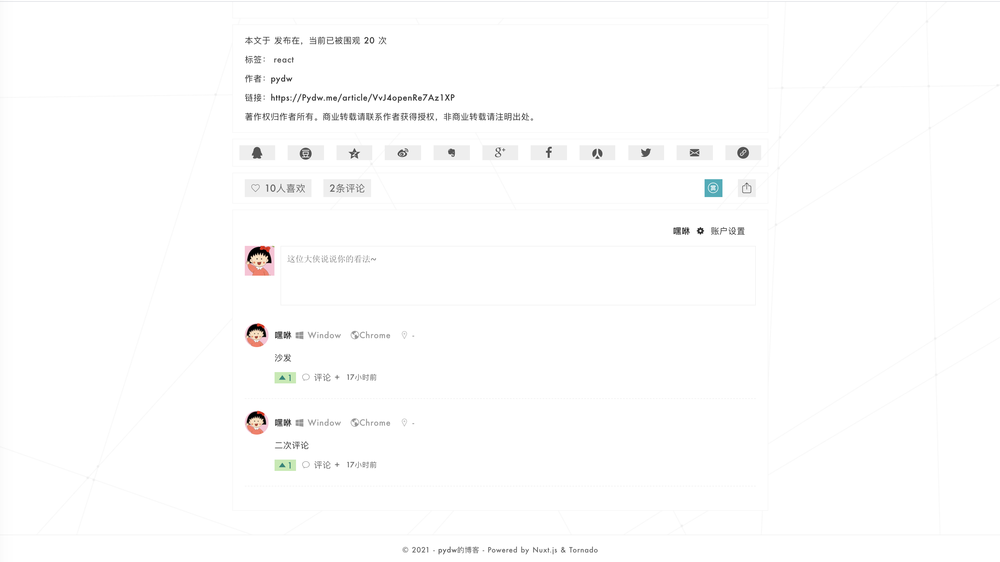
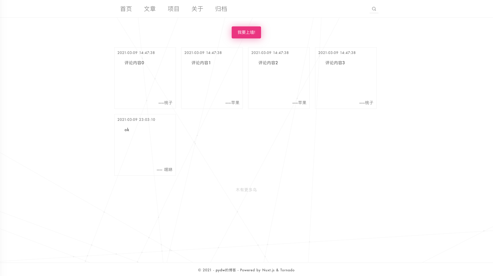
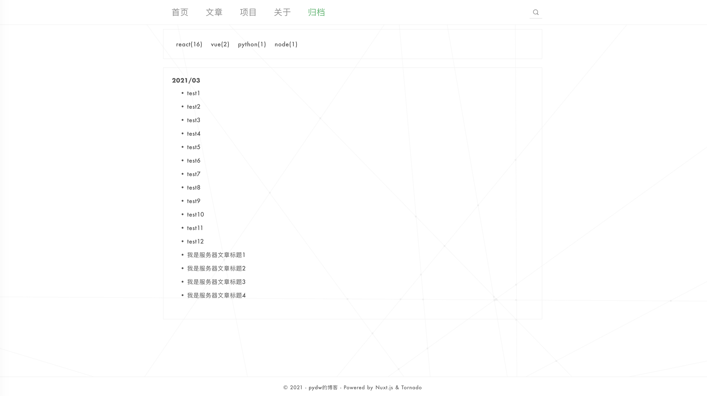
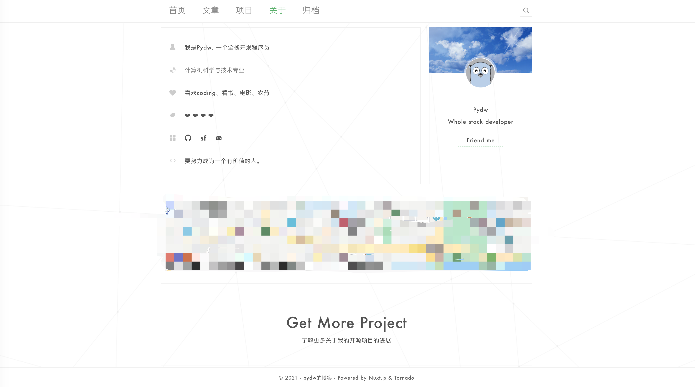

## 简述
相信每位开发者都会想拥有有一个自己blog的冲动，当然我也一样，于是就开始了当前它的开发与学习之路
## 相关链接

博客地址：[Pydw-blog](https://github.com/Iovedw/tornado-blog-web)

博客管理：[Pydw-blog-admin](https://github.com/Iovedw/tornado-blog-admin)

博客后台：[python-tornado](https://github.com/Iovedw/tornado-blog-servers)


### 相关截图:














### 相关技术栈：

+ web: vue + vuex + vue-router +nuxt
+ admin: react + redux + react-router
+ token控制
+ 按需加载，ssr
+ ....


### server

+ python + tornado + nginx + mysql + redis
+ 路由用了装饰器包装，鉴别参数是否正确
+ jwt登录权限
+ Surpervisor 进程守护
+ ....


### 未来可能加入

+ ~~移动适配~~
+ 页面数据可视化统计
+ react-native
+ ....

#### Dev

````
npm run dev
````

#### Build

````
npm run build
````

#### View build

````
npm start
````

如在浏览中遇到任何的bug，请留言我，我会第一时间修复，就此先谢谢
特别鸣谢：naihe  github: https://github.com/naihe138
